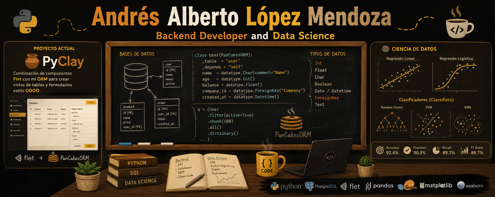

# Bienvenido 🚀

## Portafolio 💼

Por motivos de confidencialidad, no incluyo enlaces a los proyectos desarrollados en `Odoo`, ya que forman parte de mi trabajo profesional y no tengo autorización para compartirlos públicamente.

* [PanCakesORM - Documentación](https://fringe-edge-3f8.notion.site/PanCakesORM-3408851a844d80a39dd9c813c88cfb16)
* [Machiatto Framework](https://github.com/AeroGenCreator/ClayPy.git)
* [Proyecto Ferretería](https://huggingface.co/spaces/Andres-AeroGenCreator/Providencia)
* [Portafolio de Data Science](https://fringe-edge-3f8.notion.site/Andres-Lopez-M-Data-Scientist-Portafolio-2ca8851a844d80d0b61bd0c7b20a65f2?pvs=74)

## Sobre mí 💽

Soy desarrollador Backend con más de tres años de experiencia, especializado principalmente en `programación orientada a objetos (POO)`. Mi trabajo abarca el desarrollo de lógica de negocio, automatización de procesos, diseño modular de `ERPs` y administración de `bases de datos relacionales` (PostgreSQL y SQLite).

Como `desarrollador freelance` mantengo dos proyectos de código abierto: **PanCakesORM** y **Machiatto**, utilizados actualmente para el desarrollo de software empresarial en pequeños negocios del estado de Tlaxcala.

En el área de `Inteligencia Artificial` participo en el entrenamiento de agentes inteligentes integrados con bases de datos empresariales. Actualmente también soy responsable del `despliegue de servicios web` contenerizados mediante `Docker` sobre `servidores Linux`.

Cuento con un nivel de inglés **B2 (conversacional)** y fui profesor de inglés durante tres años.

Me considero una persona autodidacta, en constante aprendizaje y actualización de tecnologías para el desarrollo de software.

## Mi Stack 🎨

|Badge|Herramienta|Expansión|
|-----|-----------|---------|
||**Linux**||
||**Docker**||
||**FastAPI**||
||**Python**||
||**Odoo**||
||**HTML5**||
||**JavaScript**||
||**PostgreSQL**||
||**OpenAI API**||
||**NumPy**||
||**GO**|`Aprendiendo`|
||**Pandas**||

Ademas del uso de librerias extra:

`Streamlit, TensorFlow, Matplotlib, Pyplot, Flet.`

## Carrera 🎖️

Soy egresado de la `Benemérita Universidad Autónoma de Puebla (BUAP)`. Inicié mi trayectoria profesional como profesor de inglés durante tres años y posteriormente orienté mi carrera hacia la `Ciencia de Datos` y el `desarrollo de software`.

Participé en el desarrollo de un sistema empresarial para una ferretería local, integrando punto de venta, facturación, control de inventarios, métricas, análisis de datos y modelos de predicción mediante series de tiempo.

Más adelante desarrollé **PanCakesORM**, un ORM basado en SQLite, y posteriormente **Machiatto**, un framework frontend construido con Flet. Ambos proyectos conforman una plataforma de desarrollo empresarial escrita completamente en Python.

En mi puesto actual participo en el desarrollo de agentes inteligentes capaces de consultar en tiempo real la base de datos de Odoo para responder preguntas relacionadas con módulos de nómina, asistencias y gestión escolar (Nenova).

Actualmente curso la Licenciatura en Ingeniería en Desarrollo de Software en la Universidad Abierta y a Distancia de México (UNADM).
